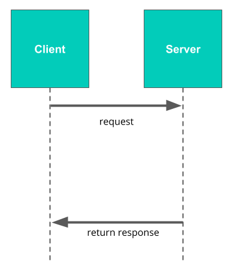
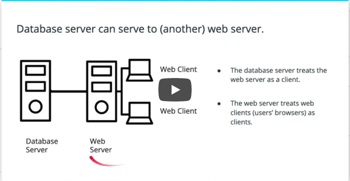

# Client-Server Model
In order to build database-backed web applications, we first need to understand how servers, clients, and databases interact.

A major part of this is the client-server model, so let's look at that first. The basic idea is very simple, and looks something like this:

A server is a centralized program that communicates over a network (such as the Internet) to serve clients.

And a client is a program (like the web browser on your computer) that can request data from a server.

When you go to a web page in your browser, your browser (the client) makes a request to the server—which then returns the data for that page.

# Adding databases to the model
So that's the basic client-server model. But when you add in databases, this creates a little more complexity.

In this next video, we'll review the basic model and then see how databases fit into things.

In summary, relational database systems follow a client-server model:

### Servers, Clients, Hosts
- In a Client-Server Model, a server serves many clients.
- Servers and clients are programs that run on hosts.
- Hosts are computers connected over a network (like the internet!).
### Requests and Responses
- A client sends a request to the server
- The server's job is to fulfill the request with a response it sends back to the client.
- Requests and responses are served via a communication protocol, which sets up the expectations and rules for how the communication occurs between servers and clients.
### Relational Database Clients
- A database client is any program that sends requests to a database
- In some cases, the database client is a web server! When your browser makes a request, the web server acts as a server (fulfilling that request), but when the web server requests data from the database, it is acting as a client to that database—and the database is the server (because it is fulfilling the request).
  
Don't let this confuse you. Basically, we call things clients when they are making a request and servers when they are fulfilling a request. Since a web server can do both, it sometimes acts as a server and sometimes acts as a client.