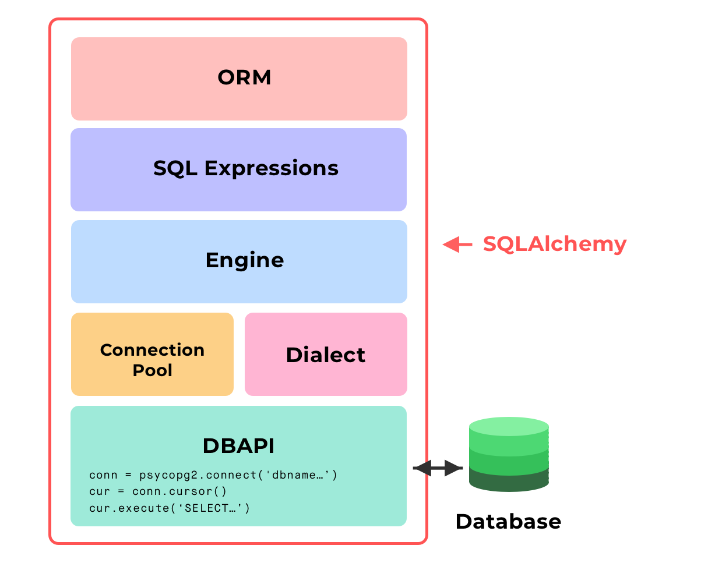

# Takeaways + A Note on ORMS
**SQLAlchemy**
- SQLAlchemy is the most popular open-source library for working with relational databases from Python.
- It is one type of ORM library, AKA an Object-Relational Mapping library, which provides an interface for using object oriented programming to interact with a database.
Other ORM libraries that exist across other languages include popular choices like javascript libraries Sequelize and Bookshelf.js for NodeJS applications, the ruby library ActiveRecord, which is used inside Ruby on Rails, and CakePHP for applications written on PHP, amongst many other such ORMs.

SQLAlchemy:

- Features **function-based query construction**: allows SQL clauses to be built via Python functions and expressions.

- **Avoid writing raw SQL.** It generates SQL and Python code for you to access tables, which leads to less database-related overhead in terms of the volume of code you need to write overall to interact with your models.

- Moreover, you can **avoid sending SQL to the database on every call**. The SQLAlchemy ORM library features **automatic caching**, caching collections and references between objects once initially loaded.

# SQLAlchemy's Layers of Abstraction
SQLAlchemy is broken down into various layers of abstraction. Let's go through each layer in depth.

## Takeaways
- Without SQLAlchemy, we'd only use a DBAPI to establish connections and execute SQL statements. Simple, but not scalable as complexity grows.
- SQLAlchemy offers several layers of abstraction and convenient tools for interacting with a database
  
**SQLAlchemy vs psycopg2**
- SQLAlchemy **generates** SQL statements
- psycopg2 directly **sends** SQL statements to the database.
SQLAlchemy depends on `psycopg2` or other database drivers to communicate with the database, under the hood.

**SQLALchemy lets you traverse through all 3 layers of abstraction to interact with your database.**
- Can stay on the ORM level
- Can dive into database operations to run customized SQL code specific to the database, on the Expressions level.
- Can write raw SQL to execute, when needed, on the Engine level.
Can more simply use psycopg2 in this case

**Good Design Practice (Opinion)**
Here's my opinion on interacting with databases using good design practice.

- Keep your code Pythonic. Work in classes and objects as much as possible.
Makes switching to a different backend easy in the future.
- Avoid writing raw SQL until absolutely necessary
In the next series of videos, we'll go over every layer of abstraction in SQLAlchemy and what they offer.

# Layers of SQLAlchemy

1. DBAPI
2. The Dialect
3. The Connection Pool
4. The Engine
5. SQL Expressions
6. SQLAlchemy ORM (optional)